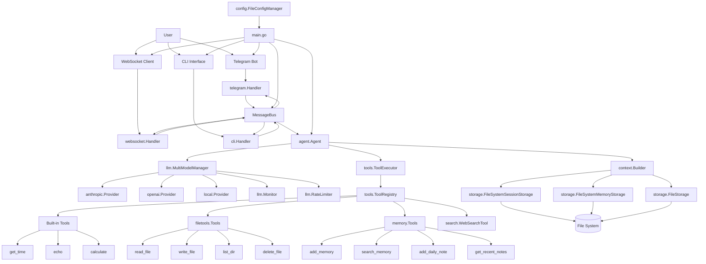
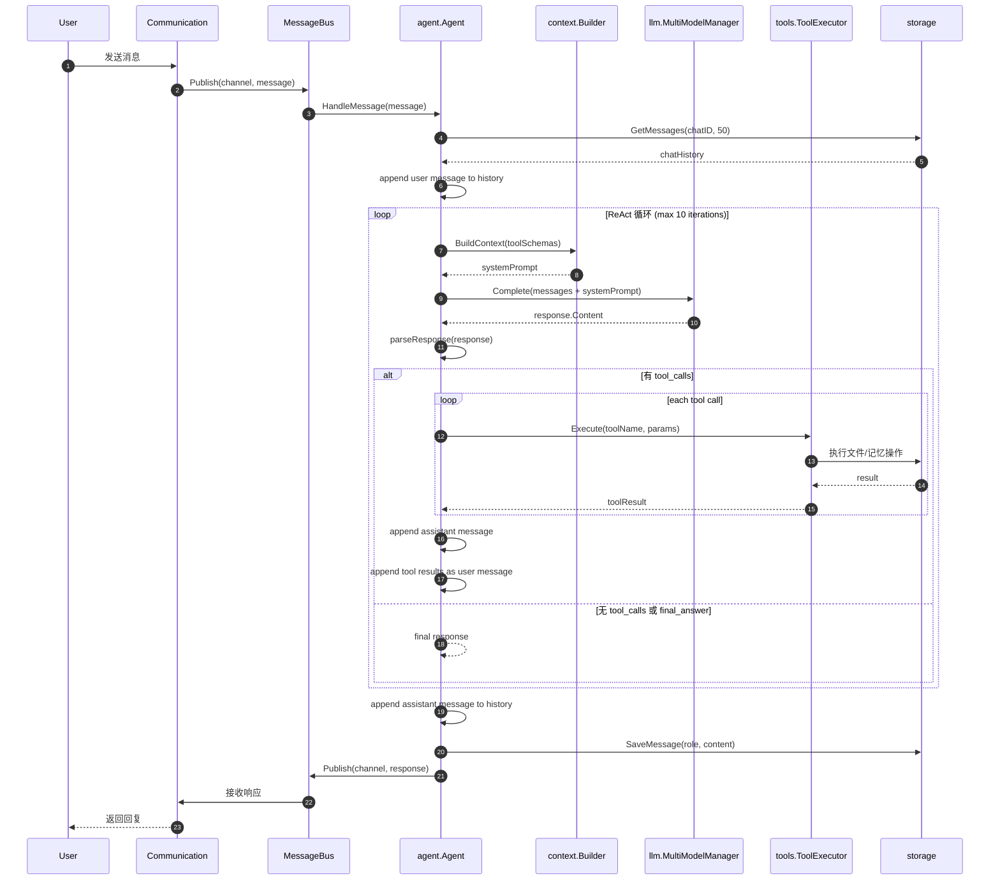

# MiniClaw Go Agent 启动前置文档

> 最后更新：2026-02-10
> 适用范围：当前工作区 `miniclaw`

## 1. 文档目标

本文件用于后续每次启动时，快速建立统一上下文：

- 项目核心设计与边界
- 当前实际架构（以代码为准）
- 实现进度
- 模块依赖关系图
- `agent.run` 主链路时序图

---

## 2. 核心设计

MiniClaw Go 是基于 Go 语言实现的 AI 助手，专为树莓派平台设计，提供轻量级、高性能的 Agent 系统。

核心原则：

1. **事件驱动**：使用消息总线解耦各模块，支持多通道通信
2. **ReAct 循环**：实现 Reasoning + Acting 循环，支持多步工具调用
3. **工具扩展**：通过 Tool 接口实现可扩展的工具系统
4. **本地存储**：文件系统存储，支持长期记忆和会话管理
5. **多模型支持**：支持 Anthropic、OpenAI、本地模型（llama.cpp）

---

## 3. 当前架构

### 3.1 分层架构

- **Communication Plane**
  - Telegram 机器人：`telegram.Bot` + `telegram.Handler`
  - WebSocket 服务：`websocket.Server` + `websocket.Handler`
  - CLI 界面：`cli.Handler`
  - 消息总线：`bus.InMemoryMessageBus`（发布/订阅模式）

- **Execution Plane**
  - 主执行器：`agent.Agent`（ReAct 多步循环）
  - 上下文构建：`context.Builder`（系统提示、记忆、工具文档）
  - 运行控制：最大迭代次数、会话历史管理

- **Extension Plane**
  - 工具注册表：`tools.ToolRegistry`
  - 工具执行器：`tools.ToolExecutor`
  - 内置工具：时间、回显、计算、文件操作、记忆、搜索

- **State Plane**
  - 文件系统存储：`storage.FileStorage`
  - 会话存储：`storage.FileSystemSessionStorage`（JSONL 格式）
  - 记忆存储：`storage.FileSystemMemoryStorage`（MEMORY.md + 每日笔记）

- **LLM Plane**
  - 多模型管理器：`llm.MultiModelManager`
  - 单一模型管理器：`llm.Manager`
  - 提供商实现：`anthropic.Provider`、`openai.Provider`、`local.Provider`
  - 性能监控：`llm.Monitor`、速率限制：`llm.RateLimiter`

### 3.2 配置管理

- **配置加载**：`config.FileConfigManager`
- **配置结构**：`config.Config`（Telegram、WebSocket、LLM、Storage、Tools、Search、Proxy）
- **默认配置**：内置默认值，支持热重载

---

## 4. 模块依赖图



---

## 5. 主链路时序图



---

## 6. 当前实现进度

| Phase | 状态 | 说明 |
|---|---|---|
| Phase 1 基础架构 | ✅ 已完成 | 消息总线、配置管理、文件系统存储 |
| Phase 2 通信模块 | ✅ 已完成 | Telegram、WebSocket、CLI 三通道通信 |
| Phase 3 LLM 集成 | ✅ 已完成 | Anthropic、OpenAI、本地模型支持 |
| Phase 4 ReAct 循环 | ✅ 已完成 | 多步推理、工具调用、迭代控制 |
| Phase 5 工具系统 | ✅ 已完成 | 工具注册表、执行器、内置工具 |
| Phase 6 记忆系统 | ✅ 已完成 | 长期记忆、每日笔记、记忆搜索 |
| Phase 7 文件操作 | ✅ 已完成 | 读写文件、列出目录、删除文件 |
| Phase 8 网络搜索 | ✅ 已完成 | Brave Search API 集成 |
| Phase 9 性能优化 | ✅ 已完成 | 连接池、速率限制、性能监控 |

---

## 7. 核心模块详解

### 7.1 消息总线

**文件**：`internal/bus/message.go`

**职责**：
- 实现发布/订阅模式的消息传递
- 支持三个通道：`telegram`、`websocket`、`cli`
- 异步消息处理，带超时控制

**核心接口**：
```go
type MessageBus interface {
    Publish(ctx context.Context, channel string, msg *Message) error
    Subscribe(channel string, handler MessageHandler) (string, error)
    Unsubscribe(channel string, handlerID string) error
    Close() error
}
```

### 7.2 Agent 服务

**文件**：`internal/agent/agent.go`

**职责**：
- 实现 ReAct 循环
- 管理会话历史
- 协调 LLM 和工具调用
- 处理用户消息并生成响应

**核心方法**：
- `HandleMessage()` - 处理用户消息
- `runReActLoop()` - 执行 ReAct 循环
- `parseResponse()` - 解析 LLM 响应

**配置项**：
- `LLMModels` - 多模型配置
- `DefaultModel` - 默认模型
- `MaxIterations` - 最大迭代次数（默认10）

### 7.3 LLM 管理

**文件**：`internal/llm/`

**职责**：
- 多模型管理：`multi.go`
- 单一模型管理：`manager.go`
- 提供商实现：`anthropic.go`、`openai.go`、`local.go`
- 性能监控：`monitor.go`
- 速率限制：`ratelimit.go`

**支持的提供商**：
- Anthropic Claude（claude-3-5-sonnet、claude-3-haiku）
- OpenAI GPT（gpt-4、gpt-3.5-turbo）
- 本地模型（llama.cpp）

**核心接口**：
```go
type LLMProvider interface {
    Complete(ctx context.Context, req *CompletionRequest) (*CompletionResponse, error)
    StreamComplete(ctx context.Context, req *CompletionRequest, callback func(chunk string) error) error
    GetModel() string
}
```

### 7.4 工具系统

**文件**：`internal/tools/`

**职责**：
- 工具注册表：`tools.go`
- 工具基础接口：`base.go`
- 内置工具：`builtin.go`
- 文件工具：`filetools/tools.go`

**核心接口**：
```go
type Tool interface {
    Name() string
    Description() string
    Parameters() json.RawMessage
    Execute(ctx context.Context, params map[string]interface{}) (string, error)
}
```

**内置工具**：
- `get_time` - 获取当前时间
- `echo` - 回显消息
- `calculate` - 数学计算

**文件工具**：
- `read_file` - 读取文件
- `write_file` - 写入文件
- `list_dir` - 列出目录
- `delete_file` - 删除文件

**记忆工具**：
- `add_memory` - 添加长期记忆
- `search_memory` - 搜索记忆
- `add_daily_note` - 添加每日笔记
- `get_recent_notes` - 获取最近笔记

**搜索工具**：
- `web_search` - 网络搜索（Brave Search）

### 7.5 存储服务

**文件**：`internal/storage/storage.go`

**职责**：
- 文件存储：`FileStorage`
- 会话存储：`FileSystemSessionStorage`
- 记忆存储：`FileSystemMemoryStorage`

**存储格式**：
- 会话消息：JSONL 格式（每行一个 JSON 对象）
- 长期记忆：`MEMORY.md`
- 每日笔记：`{date}.md`

**核心接口**：
```go
type Storage interface {
    ReadFile(ctx context.Context, path string) ([]byte, error)
    WriteFile(ctx context.Context, path string, data []byte) error
    DeleteFile(ctx context.Context, path string) error
    ListFiles(ctx context.Context, prefix string) ([]string, error)
    FileExists(ctx context.Context, path string) (bool, error)
}

type SessionStorage interface {
    SaveMessage(ctx context.Context, chatID string, role string, content string) error
    GetMessages(ctx context.Context, chatID string, limit int) ([]Message, error)
    ClearSession(ctx context.Context, chatID string) error
    ListSessions(ctx context.Context) ([]string, error)
}

type MemoryStorage interface {
    GetMemory(ctx context.Context) (string, error)
    SetMemory(ctx context.Context, content string) error
    GetDailyNote(ctx context.Context, date string) (string, error)
    SetDailyNote(ctx context.Context, date string, content string) error
}
```

### 7.6 通信模块

**文件**：`internal/communication/`

**Telegram**：
- `telegram/bot.go` - Telegram 机器人实现
- `telegram/handler.go` - 消息处理器
- 支持长轮询获取更新
- 消息分段发送（最大 4096 字符）

**WebSocket**：
- `websocket/server.go` - WebSocket 服务
- `websocket/handler.go` - 消息处理器
- 支持多客户端连接

**CLI**：
- `cli/handler.go` - 命令行界面
- 支持交互式对话

### 7.7 配置管理

**文件**：`internal/config/config.go`

**职责**：
- 加载配置文件
- 提供默认配置
- 支持配置热重载

**配置结构**：
```yaml
communication:
  telegram:
    enabled: true
    token: "bot_token"
  websocket:
    enabled: true
    port: 18789
    host: "0.0.0.0"
  cli:
    enabled: true

llm:
  provider: "anthropic"
  models:
    - name: "claude"
      provider: "anthropic"
      api_key: "api_key"
      model: "claude-sonnet-4-5"
      max_tokens: 4096
      temperature: 0.7
  default_model: "claude"

storage:
  base_path: "./data"

tools:
  web_search:
    enabled: true
    api_key: "brave_api_key"

proxy:
  enabled: false
  host: "proxy.example.com"
  port: 8080
```

---

## 8. 启动流程

**文件**：`cmd/main.go`

**启动步骤**：

1. 加载配置文件
2. 初始化消息总线
3. 初始化存储服务
4. 初始化通信模块
5. 初始化 Agent 服务
6. 注册工具
7. 启动 LLM 管理器
8. 监听系统信号，优雅关闭

**优雅关闭**：
- 停止 Telegram 机器人
- 停止 WebSocket 服务
- 停止 Agent 服务
- 关闭消息总线
- 30 秒超时控制

---

## 9. 性能优化

### 9.1 连接池

HTTP 客户端使用连接池复用连接，减少连接建立开销。

### 9.2 速率限制

`llm.RateLimiter` 实现 API 请求速率限制，防止超限。

### 9.3 性能监控

`llm.Monitor` 跟踪请求延迟、成功率、令牌使用情况。

### 9.4 请求重试

自动重试失败的请求，提高可靠性。

---

## 10. 测试

项目包含完整的测试覆盖：

- **单元测试**：每个模块都有对应的单元测试
- **集成测试**：测试各模块之间的交互

**运行测试**：
```bash
go test ./...
go test -cover ./...
```

---

## 11. 部署

### 11.1 树莓派部署

交叉编译：
```bash
GOARCH=arm64 GOOS=linux go build -o bin/miniclaw_go cmd/main.go
```

### 11.2 Docker 部署

```bash
docker build -t miniclaw_go .
docker run -d --name miniclaw_go -v $(pwd)/data:/app/data -p 8080:8080 miniclaw_go
```

---

## 12. 已知差异与待补项

1. **SubAgent 系统**
   - Java 版本支持子代理派生
   - Go 版本当前未实现

2. **Skills 系统**
   - Java 版本支持技能文件和技能选择
   - Go 版本当前未实现

3. **定时任务**
   - Java 版本支持 Cron 定时任务
   - Go 版本当前未实现

4. **渠道推送**
   - Java 版本支持邮件/Webhook 推送
   - Go 版本当前未实现

5. **远程节点管理**
   - Java 版本支持 SSH/K8s 远程执行
   - Go 版本当前未实现

6. **审计日志**
   - Java 版本支持全链路审计
   - Go 版本当前未实现

7. **Agent 身份配置**
   - Java 版本支持多 Agent 身份和权限控制
   - Go 版本当前未实现

8. **文件生成预览**
   - Java 版本支持流式文件预览面板
   - Go 版本当前未实现

9. **会话自动命名**
   - Java 版本支持 LLM 自动生成会话标题
   - Go 版本当前未实现

10. **MCP 接入**
    - 两个版本都未实现 Model Context Protocol

---

## 13. 启动阅读顺序（推荐）

1. `README.md` - 项目概述和快速开始
2. `cmd/main.go` - 主程序入口和启动流程
3. `internal/bus/message.go` - 消息总线实现
4. `internal/agent/agent.go` - Agent 核心和 ReAct 循环
5. `internal/llm/manager.go` - LLM 管理器
6. `internal/llm/types.go` - LLM 类型定义
7. `internal/tools/base.go` - 工具基础接口
8. `internal/tools/builtin.go` - 内置工具
9. `internal/storage/storage.go` - 存储服务
10. `internal/config/config.go` - 配置管理
11. `internal/communication/telegram/bot.go` - Telegram 机器人
12. `internal/context/builder.go` - 上下文构建器

---

## 14. 使用建议

核心功能已全部实现，后续建议按以下方向推进：

1. **SubAgent 系统**：实现子代理派生和编排
2. **Skills 系统**：实现技能文件解析和选择
3. **定时任务**：实现 Cron 定时任务调度
4. **渠道推送**：实现邮件/Webhook 推送
5. **远程节点管理**：实现 SSH/K8s 远程执行
6. **审计日志**：实现全链路审计记录
7. **Agent 身份配置**：实现多 Agent 身份和权限控制
8. **文件生成预览**：实现流式文件预览
9. **会话自动命名**：实现 LLM 自动生成会话标题
10. **MCP 接入**：实现 Model Context Protocol 支持
11. **更多内置工具**：丰富工具库
12. **前端界面**：开发 Web UI 界面
